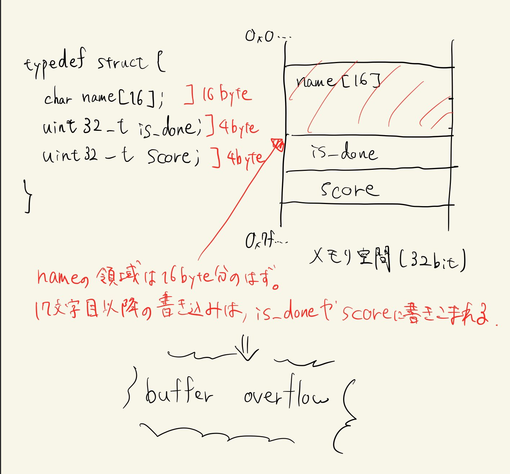

## 事前知識
### Buffer Overflow
データをメモリに書き込む際に、想定された枠を超えて書き込みをすることで、範囲外の領域に書き込みをしてしまうことです。



### 変数が保存されるメモリ領域
変数には大きく分けてグローバル変数とローカル変数の2種類があります。

### checksec
実行ファイルが持っているセキュリティ機構をを読みやすい形式で表示するシェルスクリプトです。
実行すると下記の通り表示されます。

```bash
$ checksec super_easy
[*] '/home/user/work/taskctf21/pwn/super_easy/dist/super_easy'
    Arch:     amd64-64-little   <- Architecture は amd64-64-little
    RELRO:    Full RELRO        <- RELocation REadOnly の略で、GOT Overwrite という攻撃ができない設定
    Stack:    Canary found      <- スタック上での Buffer Overflow を防ぐための機構が有効である設定
    NX:       NX enabled        <- 実行する必要のないデータを実行できなくする No eXecute bit という機構が有効である設定
    PIE:      PIE enabled       <- Position Independent Executable の略で、既知のアドレスが存在しない設定
```

